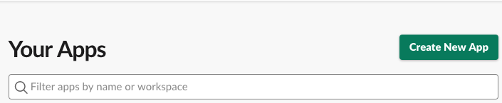
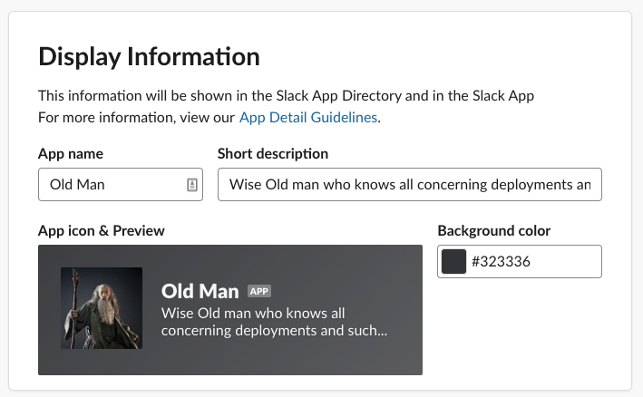
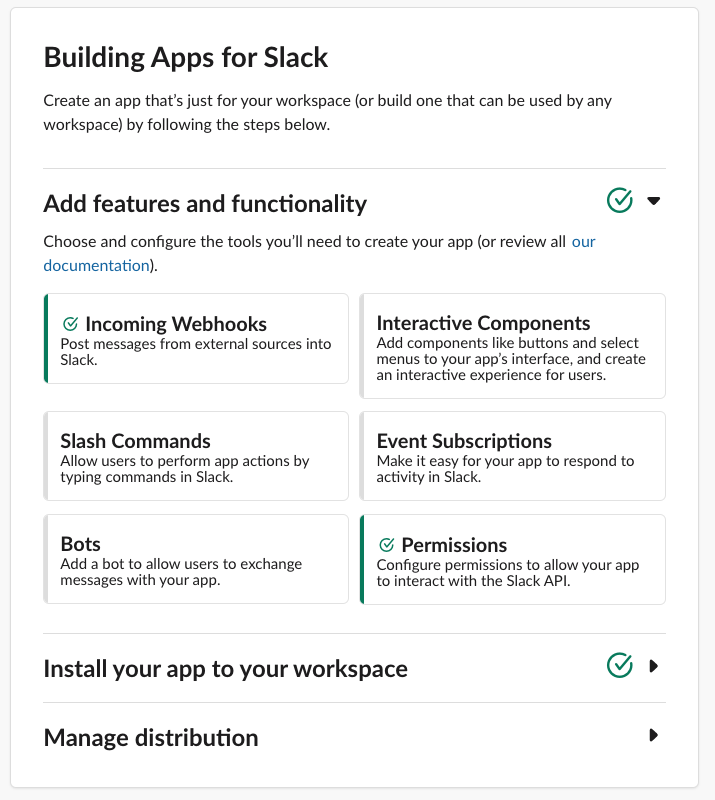

# Node Express Slack integration


Need help setting up your Slack App integration?

follow the steps below.

#### SETUP

- `git clone` this repo

- `npm install`

- create your env file

    `touch .env`
    
    ```javascript 1.8
    PORT=3000
    CLIENT_ID="*********.************" // Slack Client ID 
    CLIENT_SECRET="*******************" // Slack Client Secret
    AWS_ACCESS_KEY="**************" // your AWS ACCESS KEY
    AWS_ACCESS_SECRET="**********************" // your AWS ACCESS SECRET 
    SLACK_SIGNING_SECRET="******************" // Slack Signing Secret
    ENV="DEV"
    ```

- run it

    `npm run index.js`
    
- Testing locally

    use ngrok https://ngrok.com/
    
    `./ngrok http 3000`
    
- Create your Slack App 
    
    go to https://api.slack.com/apps and `Create New App`
    
    

    grab your CLIENT ID, CLIENT SECRET, and SIGNING SECRET and update your `.env` file.
    
    Name your App, give a description, set a background color and add an icon!
    
    

    Setup your features and functionality (if testing locally put the ngrok url in)
    
    - add a webhook (this will let you post to this url and send messages to your slack channel)
    
    - add a slash command (this server has `/slack/test` and `/slack/subscribe`) as endpoints for slash commands.
    
    - set the OAuth scopes specifying how your app needs to access Slack
    
    
    
    - Install your slack app to your slack workspace using the Add to Slack Button!
    
    The slack button is in the manage distribution area.. you might have to add a couple things to get this right or just click `Install/Reinstall` app in the `Install App` under settings. 
    
    <a href="https://slack.com/oauth/v2/authorize?client_id=*********.**********&scope=incoming-webhook,commands"></a>
    
    now test it! with your server & ngrok running locally.. 
